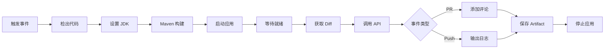

# GitHub Actions 代码评审 - 快速参考

## 🚀 快速开始

### 1. 推送代码触发评审
```bash
git add .
git commit -m "your commit message"
git push origin main
```

### 2. 创建 Pull Request
```bash
git checkout -b feature/new-feature
# Make changes
git push origin feature/new-feature
# Create PR on GitHub
```

## 📋 工作流触发条件

| 事件 | 分支 | 动作 |
|------|------|------|
| Push | main, develop | 自动评审并输出到日志 |
| Pull Request | main, develop | 自动评审并添加评论 |

## 🔍 查看评审结果

### Pull Request
- 查看 PR 中的 "🤖 AI Code Review Report" 评论

### Push
1. 进入 GitHub Actions 页面
2. 选择最新的 "AI Code Review" 运行
3. 查看 "Display Review Results" 步骤

### 下载详细结果
1. 在 Actions 运行页面底部
2. 找到 "Artifacts" 部分
3. 下载 `code-review-results`

## 🛠️ 配置要求

### 必需
- ✅ Java 17
- ✅ Maven 3.x
- ✅ ChatGLM API 密钥

### 可选
- 🔐 GitHub Secret: `CHATGLM_API_KEY_SECRET`

## 📊 评审 API 端点

### 健康检查
```
GET http://localhost:8080/api/review/health
```

### 代码评审
```
POST http://localhost:8080/api/review/code
Content-Type: application/json

{
  "diffContent": "your git diff",
  "model": "glm-4-flash",
  "repositoryName": "owner/repo",
  "branchName": "main",
  "commitId": "abc123"
}
```

### Git Diff 评审
```
GET http://localhost:8080/api/review/git/{fromHash}/{toHash}
```

## 🎯 工作流步骤



## 🔧 故障排查

### 问题: 应用无法启动
**解决方案:**
```yaml
# 增加等待时间
for i in {1..60}; do  # 从 30 改为 60
  sleep 3            # 从 2 改为 3
done
```

### 问题: API 调用失败
**解决方案:**
```bash
# 检查应用日志
cat libs/app.log

# 手动测试 API
curl http://localhost:8080/api/review/health
```

### 问题: Git Diff 为空
**解决方案:**
```bash
# 确保有提交历史
git log --oneline

# 手动检查 diff
git diff HEAD~1 HEAD
```

## 📝 最佳实践

1. **分支策略**
   - `main`: 生产环境
   - `develop`: 开发环境
   - `feature/*`: 功能分支

2. **提交信息**
   - 使用清晰的提交信息
   - 遵循 Conventional Commits 规范

3. **PR 管理**
   - 保持 PR 小而专注
   - 及时处理评审意见

4. **API 密钥管理**
   - 使用 GitHub Secrets
   - 定期轮换密钥

## 🎨 自定义示例

### 修改评审模型
```yaml
# 在 Get Git Diff 步骤中
"model": "glm-4-7-flash"  # 或 glm-4, glm-4v
```

### 添加自定义提示词
```yaml
-d '{
  "diffContent": ...,
  "customPrompt": "关注代码安全性和性能"
}'
```

### 修改触发分支
```yaml
on:
  push:
    branches:
      - main
      - develop
      - staging  # 添加新分支
```

## 📈 监控和指标

### 成功率
- 查看 Actions 成功率
- 监控 API 响应时间

### 性能
- 平均构建时间
- 平均评审时间

### 成本
- API 调用次数
- Token 使用量

## 🔗 相关链接

- [完整文档](.github/workflows/README.md)
- [项目结构](PROJECT_STRUCTURE.md)
- [ChatGLM API 文档](https://open.bigmodel.cn/dev/api)

---

**提示**: 首次运行可能需要较长时间下载依赖，后续运行会更快。
